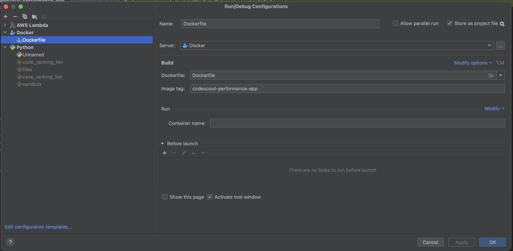
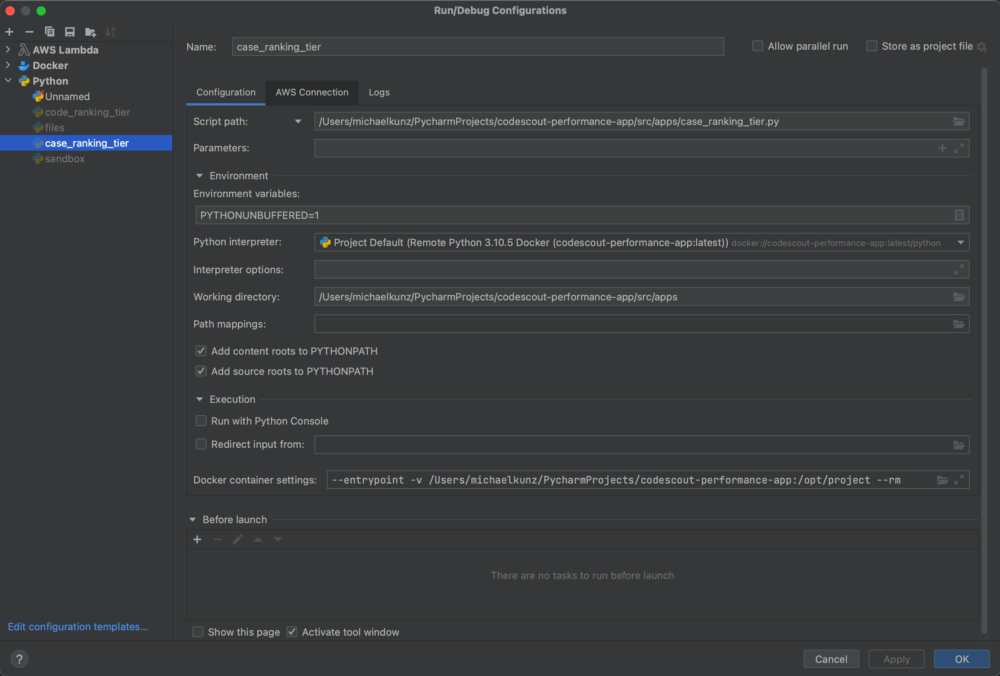
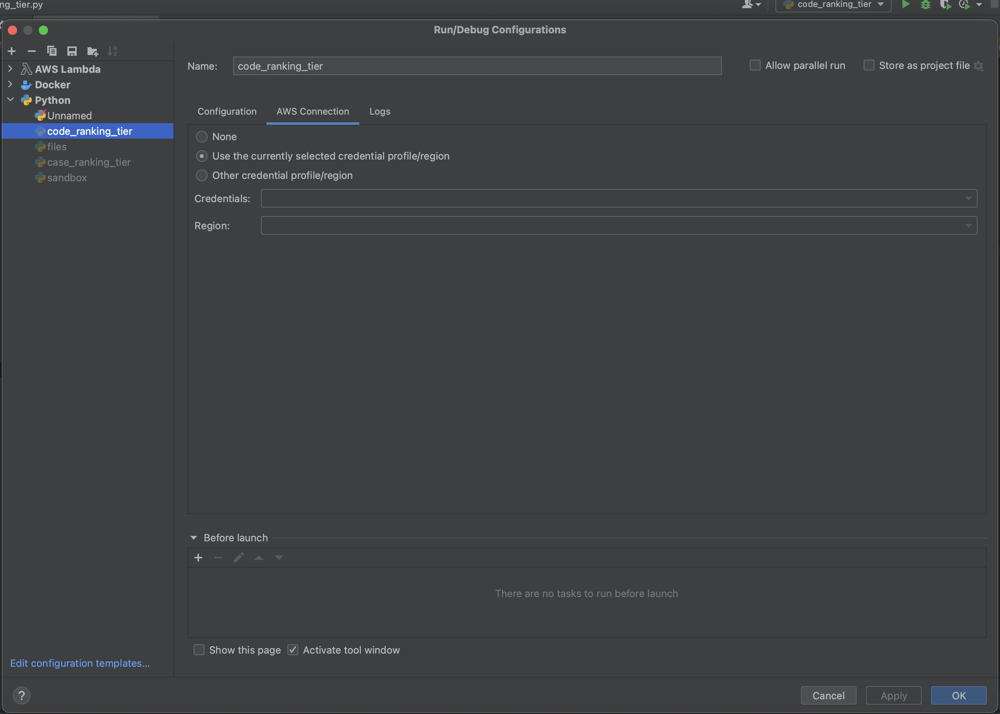
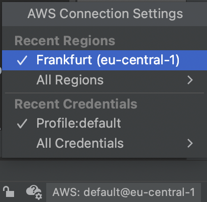

# Performance testing tool for CodeScout (CodeScout Performance App)

## About The Project

The CodeScout performance testing tool was developed to be able to measure and compare various CodeScout approaches/prototypes. 
The tool aims to take suggestions from different prototypes and measures and to compare their results, thus offering support
in finding the best working solution for CodeScout. 
Currently, the performance measure tool consists of two separate apps: 
- Code Ranking tiers
- Case ranking tiers

The corresponding .py files to run the apps can be found in the following folder: **codescout-performance-app &rarr; src &rarr; apps** 

The detailed description of the CodeScout apps can be found here [RFC 0011 - Performance testing tool for Code Scout](https://www.notion.so/aimedic/RFC-0011-Performance-testing-tool-for-Code-Scout-554e9d35b96845afa42c70f7fe8ccef2)

<h4>Technology Stack </h4>

Python 3.10.5, Docker Desktop, PyCharm IDE

<h2>Getting Started </h2>

<h4>Prerequisites</h4>

Python 3, Docker Desktop and the PyCharm IDE must be installed locally => see Technology stack

<h4>Installation (TO BE VERIFIED!) </h4>

1. Open the project folder in PyCharm 
2. In the run configurations at the top right, you need to launch the build of the docker container.
3. After the container is built successfully you need to set the python interpreter for PyCharm.
4. Go to the interpreter settings in PyCharm.
5. Click the gear icon and select add.
6. Select the image which you created in the previous step. Default: Remote Python 3.10.5 Docker (codescout-performance-app)

<h4>Setting up the Docker Environment and interpreter in the PyCharm IDE</h4>

For the apps to run, it is to be ensured that the docker environment is set up as follows in the PyCharm IDE 
<b>(Run > Edit configurations...)</b>:

To run the case ranking and code ranking tier apps, the following configurations are needed in the PyCharm IDE 
(here shown in the case ranking tier) <b>(Run > Edit configurations...)</b>:

The script path as well as the working directory are set up according to the individual local space of the user.
Another thing to ensure is that the <b>AWS Connection</b> is set to "Use the currently selected credential profile/region" (also in <b>(Run > Edit configurations...)</b>) is set up as follows:

Further, the AWS Connection setting (bottom right in PyCharm IDE) are to be set up as follows:

### Input and Output

The case ranking and code ranking both require the same input files. 

- The DtoD revision data (currently named: <code>CodeScout_GroundTruthforPerformanceMeasuring.csv</code>) containing the following variables:
    - <code> CaseId </code>, <code> CW_new </code>, <code> CW_old </code>, <code>ICD_added</code>
- The code scout results are stored in a folder with an individual path carrying a name based on '<code>hospital_year</code>'. The results are stored
in a <code>.csv</code> containing the following variables: 
  - <code>CaseId</code>, <code>SuggestedCodeRankings</code>, <code>UpcodingConfidenceScore</code> 

The resources are currently saved under <code>performance-measuring</code> and get committed to bitbucket, 
which means that the developer does not need to set it up additionally. The exact location in S3 may change due 
to restructuring. 

## Project structure

    .
    ├── resources                   
    ├── src                      
      ├── apps                     # runnalbe applications
        ├── case_ranking_tier.py  
        ├── case_ranking_tier.py    
      ├── files.py                  
      ├── rankings.py
      ├── schema.py                  
      ├── utils.py
      ├── venn.py
    ├── test                 
    ├── Dockerfile
    └── README.md

   
## Maintainers

Libraries:

<li>awswrangler</li>
<li>Pandas, Numpy, Matplotlib</li>
<li>loguru</li>
<li>For the Venn Diagramm: pyvenn, Repository: https://github.com/tctianchi/pyvenn </li> 

